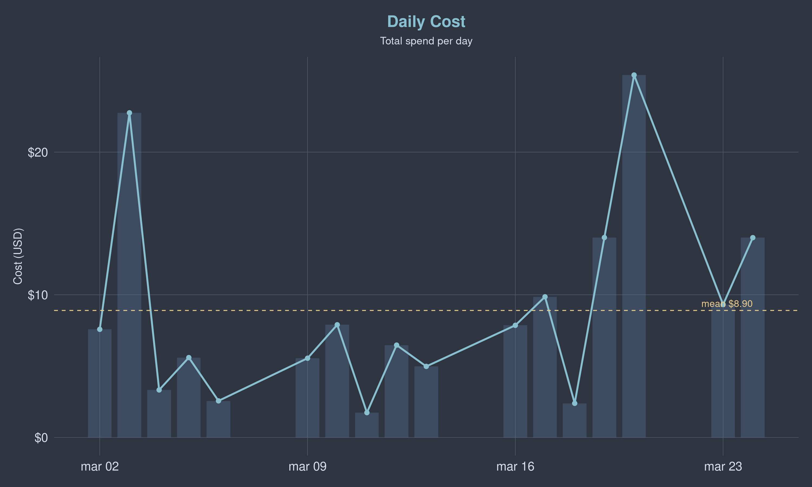

# claude-tally



Stores Claude Code `/statusline` payloads in a local SQLite database for cost tracking and usage analytics.

## Install

```bash
go install github.com/dlnilsson/claude-tally@latest
```

## Setup

Add to your statusline script (`.claude/settings.json` > `statusLine.command`):

```bash
#!/bin/bash
input=$(cat)
printf '%s' "$input" | claude-tally &
```

## Database

Stored at `$XDG_DATA_HOME/claude-tally/status.db` (default `~/.local/share/claude-tally/status.db`).

See [`queries.sql`](queries.sql) for ready-to-run examples.

## Graphs

Generate usage graphs with R:

```bash
make r-deps   # install R packages
make graphs   # generate reports/
```

Or open in RStudio and `source("graphs.R")`.
